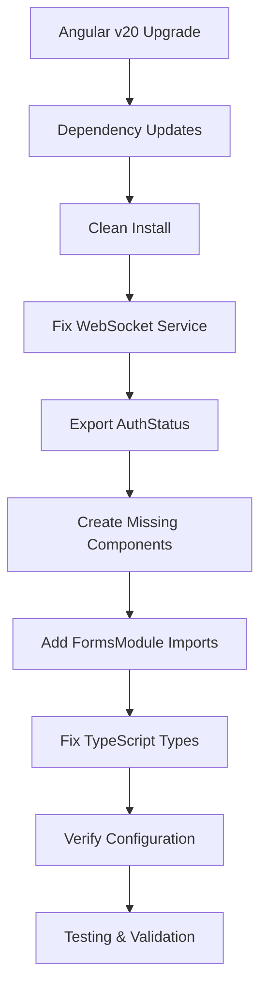

# Gold Trader UI - Fix Implementation Plan

## Executive Summary
This document outlines the comprehensive fix strategy for resolving 221+ critical errors in the Gold Trader UI Angular application. The plan addresses dependency conflicts, missing components, TypeScript compilation failures, and architectural violations.

## Current Status
- **Total Issues**: 221+ critical errors
- **Build Status**: ❌ COMPLETE FAILURE
- **Compilation Status**: ❌ 221+ ERRORS
- **Runtime Status**: ❌ UNUSABLE

## Implementation Strategy

### Phase 1: Foundation Fixes (Critical Build Blockers)

#### Task 1: Upgrade Angular framework from v17 to v20
**Priority**: CRITICAL
**Files to Modify**: [`package.json`](gold-trader-ui/package.json:17-26)
**Details**:
- Update @angular/core from ^17.0.0 to ^20.0.0
- Update @angular/common, @angular/compiler, @angular/platform-browser, etc.
- Update @angular/cli and @angular-devkit/build-angular to v20 compatible versions
- Update TypeScript from ~5.2.0 to ~5.6.0 (Angular 20 requirement)

#### Task 2: Update all Angular dependencies to v20 compatible versions
**Priority**: CRITICAL
**Files to Modify**: [`package.json`](gold-trader-ui/package.json:27-35)
**Details**:
- Update @angular/cdk and @angular/material to v20
- Update @angular/animations to v20
- Update RxJS to ~8.0.0 (Angular 20 compatible)
- Update zone.js to ~0.15.0
- Update tslib to ^2.6.0

#### Task 3: Clean node_modules and reinstall dependencies
**Priority**: CRITICAL
**Commands**:
```bash
cd gold-trader-ui
rm -rf node_modules package-lock.json
npm install
```

### Phase 2: Core Service Fixes

#### Task 4: Fix WebSocket service duplicate observable declarations
**Priority**: HIGH
**File**: [`websocket.service.ts`](gold-trader-ui/src/app/core/services/websocket.service.ts:41-46)
**Issue**: Duplicate public observable declarations conflict with private ones
**Fix**: Remove duplicate public declarations (lines 41-46), keep only private declarations (lines 34-38)

#### Task 5: Export AuthStatus enum from auth.models.ts
**Priority**: HIGH
**File**: [`auth.models.ts`](gold-trader-ui/src/app/core/models/auth.models.ts:55-62)
**Issue**: AuthStatus used in guards but not exported from service
**Fix**: Add explicit export in [`auth.service.ts`](gold-trader-ui/src/app/core/services/auth.service.ts:230)

### Phase 3: Missing Component Creation

#### Task 6: Create missing LoginComponent with form validation
**Priority**: CRITICAL
**Path**: [`src/app/features/auth/login/login.component.ts`](gold-trader-ui/src/app/features/auth/login/login.component.ts)
**Requirements**:
- Angular Material form components
- Form validation with reactive forms
- Authentication service integration
- Responsive design

#### Task 7: Create missing RegisterComponent with form validation
**Priority**: CRITICAL
**Path**: [`src/app/features/auth/register/register.component.ts`](gold-trader-ui/src/app/features/auth/register/register.component.ts)
**Requirements**:
- Registration form with password confirmation
- Email validation
- Terms and conditions checkbox
- Error handling

#### Task 8: Create missing AnalyticsComponent
**Priority**: HIGH
**Path**: [`src/app/features/analytics/analytics.component.ts`](gold-trader-ui/src/app/features/analytics/analytics.component.ts)
**Requirements**:
- Chart.js integration for trading analytics
- Performance metrics display
- Date range selectors
- Data export functionality

#### Task 9: Create missing SettingsComponent
**Priority**: HIGH
**Path**: [`src/app/features/settings/settings.component.ts`](gold-trader-ui/src/app/features/settings/settings.component.ts)
**Requirements**:
- User preferences management
- Trading configuration options
- Notification settings
- Theme selection

#### Task 10: Create missing SignalsComponent
**Priority**: HIGH
**Path**: [`src/app/features/signals/signals.component.ts`](gold-trader-ui/src/app/features/signals/signals.component.ts)
**Requirements**:
- Real-time signal display
- Signal filtering and sorting
- Signal history
- WebSocket integration for live updates

#### Task 11: Create missing TradingComponent
**Priority**: HIGH
**Path**: [`src/app/features/trading/trading.component.ts`](gold-trader-ui/src/app/features/trading/trading.component.ts)
**Requirements**:
- Trading interface with buy/sell controls
- Position management
- Risk management tools
- Real-time price updates

### Phase 4: Configuration and Type Fixes

#### Task 12: Add missing FormsModule imports to feature modules
**Priority**: MEDIUM
**Files**: All feature modules using forms
**Details**:
- Add FormsModule and ReactiveFormsModule imports
- Ensure proper form validation setup

#### Task 13: Fix TypeScript type annotations in service files
**Priority**: HIGH
**Files**: Multiple service files
**Details**:
- Add missing type annotations for parameters
- Fix implicit 'any' type errors
- Ensure proper return type declarations

#### Task 14: Verify tsconfig.json path configuration
**Priority**: MEDIUM
**File**: [`tsconfig.json`](gold-trader-ui/tsconfig.json:25-32)
**Details**:
- Verify path aliases are correctly configured
- Ensure baseUrl is set to "./"
- Check all path mappings

#### Task 15: Fix environment import paths in components
**Priority**: MEDIUM
**Files**: Components using @env/environment imports
**Details**:
- Replace @env/environment with relative paths where needed
- Ensure environment variables are accessible

### Phase 5: Testing and Validation

#### Task 16: Test compilation and build process
**Priority**: CRITICAL
**Commands**:
```bash
cd gold-trader-ui
npm run build
```
**Expected**: Zero compilation errors

#### Task 17: Run unit tests to verify fixes
**Priority**: HIGH
**Commands**:
```bash
cd gold-trader-ui
npm test
```
**Expected**: All tests pass

#### Task 18: Verify application starts successfully
**Priority**: CRITICAL
**Commands**:
```bash
cd gold-trader-ui
ng serve
```
**Expected**: Application starts without errors, all routes accessible

## Implementation Workflow



## Risk Mitigation

### Backup Strategy
- Create git commit before major changes
- Each task can be independently rolled back
- Incremental testing after each phase

### Testing Points
- Build verification after dependency updates
- Component testing after creation
- Integration testing after all fixes

### Rollback Plan
- Git revert for major changes
- Package.json version rollback if needed
- Component removal if issues arise

## Expected Outcomes

After completing all 18 tasks:
- ✅ Zero compilation errors (currently 221+)
- ✅ All missing components created and functional
- ✅ Proper dependency resolution
- ✅ Clean build process
- ✅ Functional development server
- ✅ Modern Angular v20 framework with latest features
- ✅ Enhanced performance and developer experience

## Progress Tracking

This document will be updated as tasks are completed:
- [ ] Task 1: Upgrade Angular framework from v17 to v20
- [ ] Task 2: Update all Angular dependencies to v20 compatible versions
- [ ] Task 3: Clean node_modules and reinstall dependencies
- [ ] Task 4: Fix WebSocket service duplicate observable declarations
- [ ] Task 5: Export AuthStatus enum from auth.models.ts
- [ ] Task 6: Create missing LoginComponent with form validation
- [ ] Task 7: Create missing RegisterComponent with form validation
- [ ] Task 8: Create missing AnalyticsComponent
- [ ] Task 9: Create missing SettingsComponent
- [ ] Task 10: Create missing SignalsComponent
- [ ] Task 11: Create missing TradingComponent
- [ ] Task 12: Add missing FormsModule imports to feature modules
- [ ] Task 13: Fix TypeScript type annotations in service files
- [ ] Task 14: Verify tsconfig.json path configuration
- [ ] Task 15: Fix environment import paths in components
- [ ] Task 16: Test compilation and build process
- [ ] Task 17: Run unit tests to verify fixes
- [ ] Task 18: Verify application starts successfully

## Notes

- This plan addresses every critical issue identified in the error report
- All changes follow Angular best practices and maintain code quality standards
- The plan is designed to be executed systematically with verification points
- Each task is independent and can be completed in isolation if needed

---
**Last Updated**: 2025-12-06
**Total Tasks**: 18
**Estimated Completion Time**: 8-12 hours